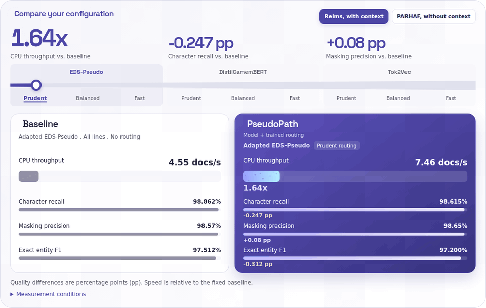

# PseudoPath

PseudoPath trains a named-entity recognition (NER) model, learns a residual
line router, and calibrates three recall budgets. Prediction combines the
model with fixed rules adapted from EDS-Pseudo and returns spaCy entities.

Three integrated presets keep the common workflow short: `camembert`,
`distilcamembert`, and `tok2vec`. You can also supply your own model and
adapter without changing the rules or router.

Compare CPU throughput and detection quality across models and routing
presets in the [interactive benchmark](https://iias-research.github.io/PseudoPath/#flow-benchmark).

[](https://iias-research.github.io/PseudoPath/#flow-benchmark)

Python 3.11 or newer is required. Install from PyPI:

```bash
python -m pip install pseudopath
# For CamemBERT or DistilCamemBERT:
python -m pip install 'pseudopath[transformer]'
```

No separate `eds-pseudo` installation is needed.

Train, predict, and save in a few lines:

```python
from pseudopath import PseudoPath, Tok2VecTraining, read_jsonl

pipeline = PseudoPath.from_preset("tok2vec")
pipeline.fit(
    read_jsonl("train.jsonl"),
    read_jsonl("validation.jsonl"),
    training=Tok2VecTraining(steps=100, validation_interval=20),
)
entities = pipeline.predict("Luc Martin consulte.", routing="balanced")
pipeline.to_disk("pseudopath-artifact")
restored = PseudoPath.from_disk("pseudopath-artifact")
```

`read_jsonl` reads text and annotated character offsets into spaCy documents.
See the [quickstart](https://iias-research.github.io/PseudoPath/quickstart.html) for the data format and
[examples](examples/) for short workflows with synthetic data. Run them
from the repository root, for example:

```bash
python examples/train_tok2vec.py
python examples/predict.py
```

See [models and configuration](https://iias-research.github.io/PseudoPath/models.html) for preset backbones,
architecture overrides, and learning controls. For a trained external
checkpoint, follow [custom models](https://iias-research.github.io/PseudoPath/custom-models.html).

`fit` trains the model and router and calibrates `"prudent"`,
`"balanced"`, and `"fast"` against `"all-lines"`. You can instead set
any numeric routing threshold in `[0, 1]`. A later `fit` continues the
model and, by default, the router. `reset_router=True` starts a new router.
`predict(text)` and `predict(doc)` return spaCy spans without changing the
input document's annotations.

Read the [documentation](https://iias-research.github.io/PseudoPath/) for
installation, training, and inference. The
[API reference](https://iias-research.github.io/PseudoPath/api.html) describes
public methods, and
[architecture](https://iias-research.github.io/PseudoPath/architecture.html)
explains how the pipeline works.

PseudoPath's own code is licensed under GPL-3.0-only. Selected EDS-Pseudo
v0.4.0 patterns and derived training behavior retain BSD-3-Clause terms. See
[LICENSE](LICENSE) and [THIRD_PARTY_NOTICES.md](THIRD_PARTY_NOTICES.md).
